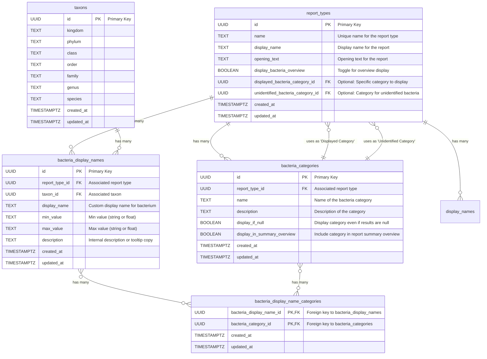

The `report_types` table has two optional foreign keys, `displayed_bacteria_category_id` and `unidentified_bacteria_category_id`, which both reference the `bacteria_categories` table. This creates a relationship where a report type can, but is not required to, specify particular bacteria categories for special display purposes.

The `bacteria_categories` and `display_names` tables are both directly related to the `report_types` table, with each record in these tables belonging to a single report type. This is enforced by the `report_type_id` foreign key in both tables. The `ON DELETE RESTRICT` clause on these foreign keys prevents a report type from being deleted if it still has associated bacteria categories or display names. This ensures data integrity.

The `taxons` table stores hierarchical taxonomic information.

The `bacteria_display_names` table links `report_types` and `taxons` to provide custom display names, min/max values, and descriptions for bacteria.

The `bacteria_display_name_categories` table is a join table that establishes a many-to-many relationship between `bacteria_display_names` and `bacteria_categories`, allowing a custom bacteria display name to belong to multiple categories.
