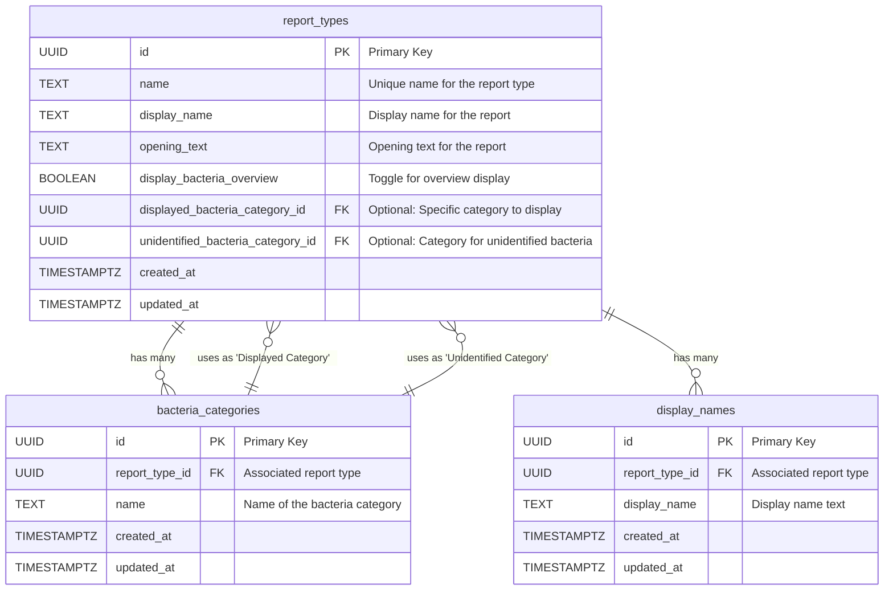

```mermaid
erDiagram
    report_types {
        UUID id PK "Primary Key"
        TEXT name "Unique name for the report type"
        TEXT display_name "Display name for the report"
        TEXT opening_text "Opening text for the report"
        BOOLEAN display_bacteria_overview "Toggle for overview display"
        UUID displayed_bacteria_category_id FK "Optional: Specific category to display"
        UUID unidentified_bacteria_category_id FK "Optional: Category for unidentified bacteria"
        TIMESTAMPTZ created_at
        TIMESTAMPTZ updated_at
    }

    bacteria_categories {
        UUID id PK "Primary Key"
        UUID report_type_id FK "Associated report type"
        TEXT name "Name of the bacteria category"
        TIMESTAMPTZ created_at
        TIMESTAMPTZ updated_at
    }

    display_names {
        UUID id PK "Primary Key"
        UUID report_type_id FK "Associated report type"
        TEXT display_name "Display name text"
        TIMESTAMPTZ created_at
        TIMESTAMPTZ updated_at
    }

    report_types ||--o{ bacteria_categories : "has many"
    report_types ||--o{ display_names : "has many"
    report_types }o--|| bacteria_categories : "uses as 'Displayed Category'"
    report_types }o--|| bacteria_categories : "uses as 'Unidentified Category'"

```